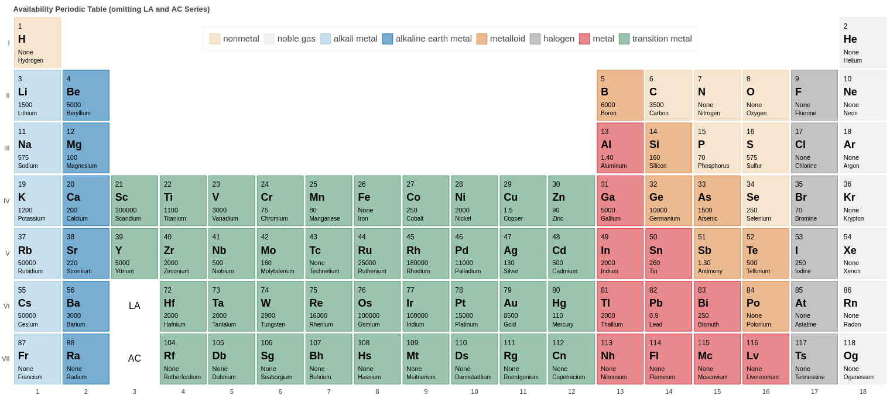

# Availability-Periodic-Table

The program _periodic_table.py_ can generate a custom [interactive periodic table](Availability_periodic_table.html) by [element information](Element_information.csv), in which the information of the price, abundance, and isotope stability comes from the CRC handbook[^1].

[^1]: CRC Handbook of Chemistry and Physics. (CRC Press, 2016). doi:10.1201/9781315380476.
